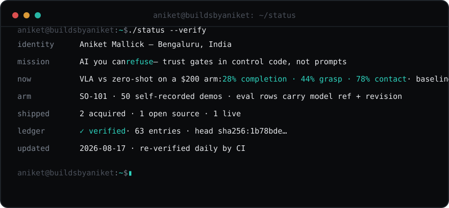

**ARM-ANI in 90 seconds** — a voice-interactive robot arm with the trust gates in the control path, not the prompt: asks when ambiguous, states confidence aloud, stands down after 10 seconds of silence.

## Shipped

| | Project | Proof |
|---|---|---|
| 🧠 | [**TRIBE v2 Creative Workbench**](https://github.com/aniketmallick/tribe-v2-creative-workbench) | Compare how two videos activate the brain — Meta TRIBE v2, 20,484-vertex cortical predictions, interactive difference maps. MIT. |
| 🕹️ | [**Await Arcade**](https://await-arcade.vercel.app) | Atomic cognitive games for the seconds your agent is thinking. Used in hackathons for collaborative sessions and competitions. |
| 🏥 | **Medical-AI CRM** · **Patient platform on WhatsApp** | Both acquired, 2026. Buyer and terms private — labeled, not embellished. |
| 🔗 | [**Life-OS**](https://buildsbyaniket.com/log) | An AI that graded my discipline in public — SHA-256 hash-chained, frozen, still [publicly verifiable](https://buildsbyaniket.com/verify). |

## Track record

· C3 AI (2024–2026) — glass-box forecast explainability, 33% stockout reduction 
· Oracle (2022–2024) — systems serving 1B+ users 
· ACM-ICPC regionals (2019–20) · B.Tech CSE, IEM Kolkata(CGPA: 9.14)

This profile is a ledger: claims are dated and linked; private items are labeled, not embellished.
